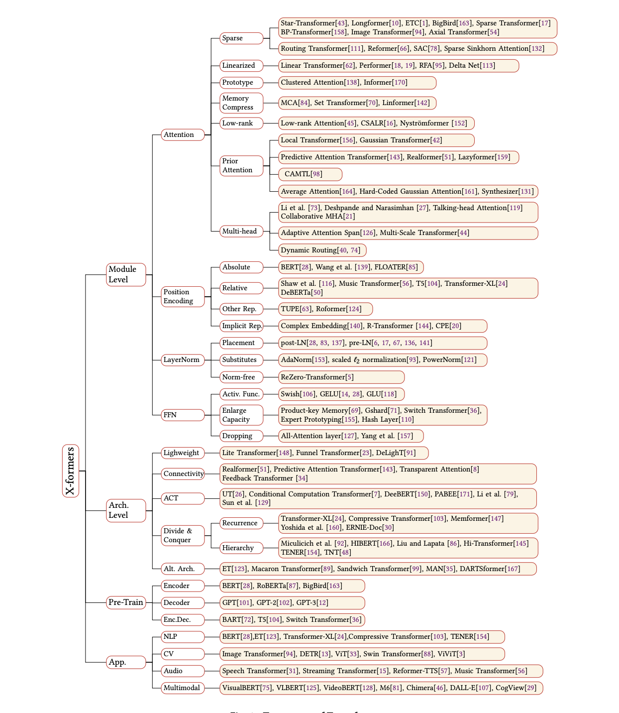

# Learn_NLP_with_transformers

Status: NLP

- lESSON0
    - 资源：
        - 自然语言与深度学习的课程推荐：[CS224n](http://web.stanford.edu/class/cs224n/): Natural Language Processing with Deep Learning
        - 自然语言处理的书籍推荐：[Speech and Language Processing](https://web.stanford.edu/~jurafsky/slp3/)

    - 任务： 1、文本分类， 2、序列标注，3、问答任务——抽取式问答和多选问答，4、生成任务——语言模型、机器翻译和摘要生成。
    - Transformer的兴起
        - 2017年，Attention Is All You Need论文首次提出了Transformer模型结构并在机器翻译任务上取得了The State of the Art(SOTA, 最好)的效果。
        - 2018年，BERT: Pre-training of Deep Bidirectional Transformers for Language Understanding使用Transformer模型结构进行大规模语言模型（language model）预训练（Pre-train），再在多个NLP下游（downstream）任务中进行微调（Finetune）,一举刷新了各大NLP任务的榜单最高分，轰动一时。2019年-2021年，研究人员将**Transformer这种模型结构**和**预训练+微调**这种训练方式相结合，提出了一系列Transformer模型结构、训练方式的改进（比如transformer-xl，XLnet，Roberta等等）。入下图所示，各类Transformer的改进不断涌现。

            [A Survey of Transformers](https://arxiv.org/pdf/2106.04554.pdf)

        

## lESSON1:Attention

- seq2seq模型:

    由编码器（Encoder）和解码器（Decoder）组成的

    Encoder:  seq → encoder→context(词向量) →decoder→ seq

    以机器翻译为例，seq为文本序列。

    - 码器和解码器在Transformer出现之前一般采用的是循环神经网络
    - 在机器翻译任务中，上下文（context）是一个**向量**, 编写seq2seq模型的时候设置上下文向量的长度。这个长度是基于编码器 RNN 的隐藏层神经元的数量

    Decoder: 

    编码器和解码器在Transformer出现之前一般采用的是循环神经网络。关于循环神经网络，

- Attention:

    事实证明，**上下文context向量(RNN: 最后一个 hidden state（隐藏层状态）**是这类模型的瓶颈。这使得模型在处理长文本时面临非常大的挑战。

    编码器会把更多的数据传递给解码器。编码器把**所有时间步的 hidden state（隐藏层状态）**传递给解码器，而不是只传递最后一个 hidden state（隐藏层状态）:

    - 编码器中每个 hidden state（隐藏层状态）都对应到输入句子中一个单词。
    - 给每个 hidden state（隐藏层状态）一个分数
    - 将每个 hidden state（隐藏层状态）乘以经过 softmax 的对应的分数，从而，高分对应的 hidden state（隐藏层状态）会被放大，而低分对应的 hidden state（隐藏层状态）会被缩小。
- 如何把每个单词都转化为一个向量呢？

    我们使用一类称为 "**word embedding"** 的方法。这类方法把单词转换到一个向量空间，这种表示能够捕捉大量单词之间的语义信息（例如，king - man + woman = queen例子来源）。

    我们在处理单词之前，需要把他们转换为向量。这个转换是使用 word embedding 算法来完成的。我们可以使用预训练好的 embeddings，或者在我们的数据集上训练自己的 embedding。通常 embedding 向量大小是 200 或者 300，为了简单起见，我们这里展示的向量长度是4。上图左边每个单词对应中间一个4维的向量。

    编码器和解码器在每个时间步处理输入，并得到输出。由于编码器和解码器都是 RNN，RNN 会根据当前时间步的输入，和前一个时间步的 hidden state（隐藏层状态），更新当前时间步的 hidden state（隐藏层状态）

## LESSION2:Transformer

- Overview：

    假设一个 Transformer 是由 2 层编码器和两层解码器组成的：

    

### 2.1 Self-Attention 整体理解

- Attention_output计算
    - attention 中 query, key，value. [参考](https://zhuanlan.zhihu.com/p/148737297)

        soft addressing:
        从图1可以引出另外一种理解，也可以将Attention机制看作一种**软寻址**（Soft Addressing）:
        Source可以看作存储器内存储的内容，元素由地址Key和值Value组成，当前有个Key=Query的查询，目的是取出存储器中对应的Value值，即Attention数值。通过Query和存储器内元素Key的地址进行相似性比较来寻址，之所以说是软寻址，指的不像一般寻址只从存储内容里面找出一条内容，而是可能从每个Key地址都会取出内容，取出内容的重要性根据Query和Key的相似性来决定，之后对Value进行加权求和，这样就可以取出最终的Value值，也即Attention值

        其归纳为两个过程：第一个过程是根据Query和Key计算权重系数，第二个过程根据权重系数对Value进行加权求和。而第一个过程又可以细分为两个阶段：第一个阶段根据Query和Key计算两者的相似性或者相关性；第二个阶段对第一阶段的原始分值进行归一化处理.

        **相似性计算：**

        点积：

        Cosine相似性：

        MLP网络

- 多头注意力机制（multi-head attention）

    多头注意力机制会有多组$W^Q, W^K W^V$ 的权重矩阵（在 Transformer 的论文中，使用了 8 组注意力（attention heads）

    每一组注意力$W^Q, W^K W^V$ 可以看作是把输入的向量映射到一个”子表示空间“。

    8组WQ, WK, WV 权重矩阵 → 8 组 Q, K, V 矩阵 →  8 个 Z 矩阵

    →拼接起来，然后和另一个权重矩阵$W^O$相乘→1个矩阵

- 代码实现矩阵计算 Attention

    ```python
    torch.nn.MultiheadAttention(embed_dim, num_heads, dropout=0.0, bias=True, add_bias_kv=False, add_zero_attn=False, kdim=None, vdim=None)
    ```

    >> Init:

    - embed_dim
    - num_heads

    >> Forward Input:

    - query
    - key
    - value

    >> Output：

    - attn_output
    - attn_output_weights
    - Attention

        ```python
        torch.nn.MultiheadAttention(embed_dim, num_heads, dropout=0.0, 
        				bias=True, add_bias_kv=False, add_zero_attn=False, kdim=None, vdim=None)
        
        Parameter：
        
        embed_dim – total dimension of the model.
        
        num_heads – parallel attention heads.
        
        dropout – a Dropout layer on attn_output_weights. Default: 0.0.
        
        bias – add bias as module parameter. Default: True.
        
        add_bias_kv – add bias to the key and value sequences at dim=0.
        
        add_zero_attn – add a new batch of zeros to the key and value sequences at dim=1.
        
        kdim – total number of features in key. Default: None.
        
        vdim – total number of features in value. Default: None.
        
        batch_first – If True, then the input and output tensors are provided as (batch, seq, feature). Default: False (seq, batch, feature).
        ```

        FORWAD:

        ```python
        forward(query, key, value, key_padding_mask=None, need_weights=True, 
        				attn_mask=None)
        
        Parameter:
        key, value (query,) – map a query and a set of key-value pairs to an output. See “Attention Is All You Need” for more details.
        ```

细节：

- difference between attention and self-attention:
    - AT is often applied to transfer information from encoder to decoder. I.e. decoder neurons receive addition input (via AT) from the encoder states/activations. So in this case AT connects 2 different components - encoder and decoder. If SA is applied - it doesn't connect 2 different components, it's applied within one component. There may be no decoder at all if you use SA, as for example in BERT architecture.
    - SA may be applied many times independently within a single model (e.g. 18 times in Transformer, 12 times in BERT BASE) while AT is usually applied once in the model and connects some 2 components (e.g. encoder and decoder).
    - Key/Query/Value approach of attention calculation is usually applied to SA. But you can use it for AT also.

### 2.2 Encoder编码器：

编码器（Encoder）接收的输入都是一个向量列表，输出也是大小同样的向量列表

### 2.3 Decoder解码器：

编码器一般有多层，第一个编码器的输入是一个序列，最后一个编码器输出是一组注意力向量 K 和 V。这些注意力向量将会输入到每个解码器的Encoder-Decoder Attention层，这有助于解码器把注意力集中中输入序列的合适位置。

解码器中的 Self Attention 层，和编码器中的 Self Attention 层不太一样：在解码器里，Self Attention 层只允许关注到输出序列中早于当前位置之前的单词。具体做法是：在 Self Attention 分数经过 Softmax 层之前，屏蔽当前位置之后的那些位置。

Encoder-Decoder Attention层的原理和多头注意力（multiheaded Self Attention）机制类似，不同之处是：**Encoder-Decoder Attention层是使用前一层的输出来构造 Query 矩阵，而 Key 矩阵和 Value 矩阵来自于解码器最终的输出。**

解码（decoding ）阶段的每一个时间步都输出一个翻译后的单词（这里的例子是英语翻译）。


batch_size: N

时间步： 12

### 2.4 使用位置编码来表示序列的顺序

### 2.5 残差连接与LayerNorm：


### 2.6 最后的线性层和 Softmax 层

### 2.7 训练

模型训练过程能够并行计算:

在 RNN 中，每一个 time step 的计算都依赖于上一个 time step 的输出，这就使得所有的 time step 必须串行化，无法并行计算，

在 Transformer 中，所有 time step 的数据，都是经过 Self Attention 计算，使得整个运算过程可以并行化计算。

step1:对输入编码器的每个词向量，都创建 3 个向量，分别是：Query 向量，Key 向量，Value 向量

这 3 个向量是词向量分别和 3 个矩阵相乘得到的，而这个矩阵是我们要学习的参数。

step2:计算 Attention Score（注意力分数）

这些分数，是通过计算 "Thinking" 对应的 Query 向量和其他位置的每个词的 Key 向量的点积，而得到的。

